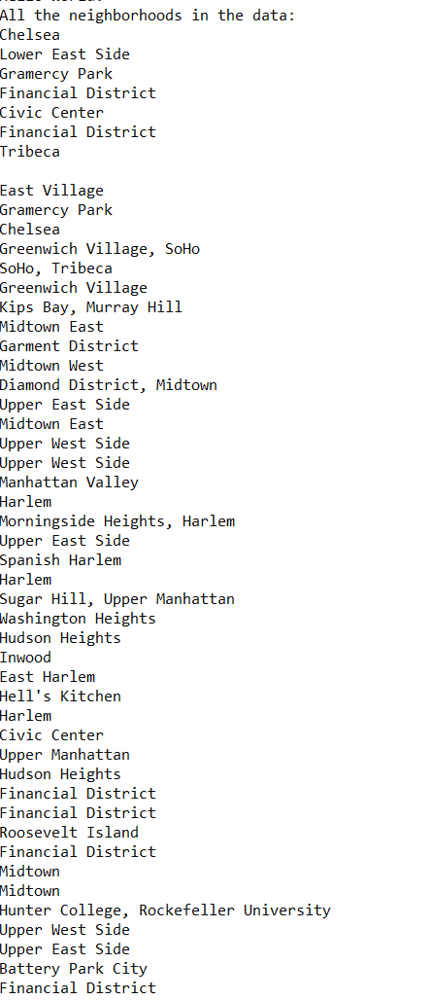

# Lab 08 - LINQ
A console application that filters through JSON data that represents NYC neighborhoods

## The Problem Domain
- Read in the file and answer the questions below
- Use LINQ queries and Lambda statements (when appropriate) to find the answers.
- Use a combination of both to answer the questions.
- Add the data.json file to your solution root folder
- Explore the NuGet packages and install NewtonSoftJson
- Do some self research and find out how to read in JSON file (hint: JsonConvert.DeserializedOject is part of it)
- You will need to break up each section of the JSON file up into different classes
- Output all of the neighborhoods in this data list
- Filter out all the neighborhoods that do not have any names
- Remove the Duplicates
- Rewrite the queries from above, and consolidate all into one single query.
- Rewrite at least one of these questions only using the opposing method (example: Use LINQ instead of a Lambda and vice versa.)

## Purpose
- To master the fundamentals of LINQ querying

## How to run
- Open with Visual Studio
- Start Without Debugging
### From the command line:
- git clone git@github.com:carloscadena/Lab08-LINQ.git
- cd Lab08-LINQ/Lab08-LINQ
- dotnet run

## Visual Example
The program should look like the following:

